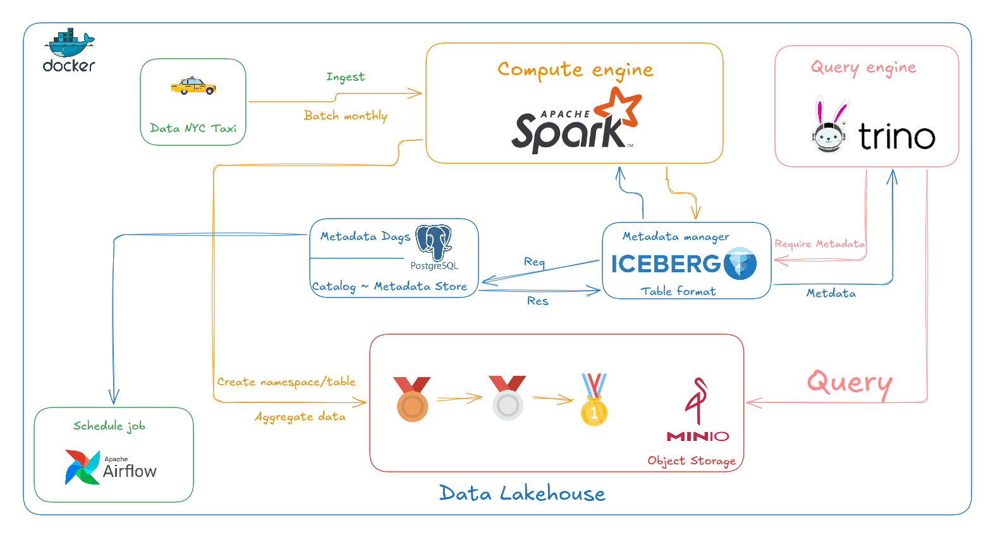
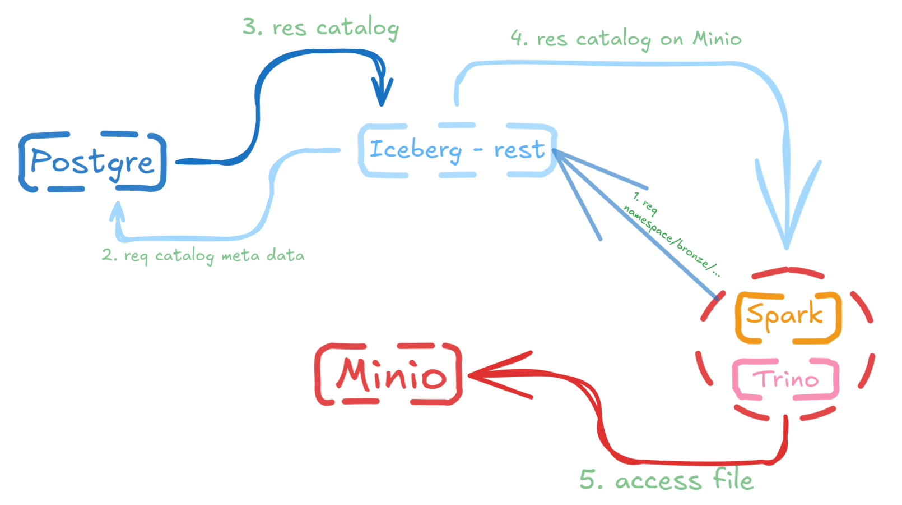
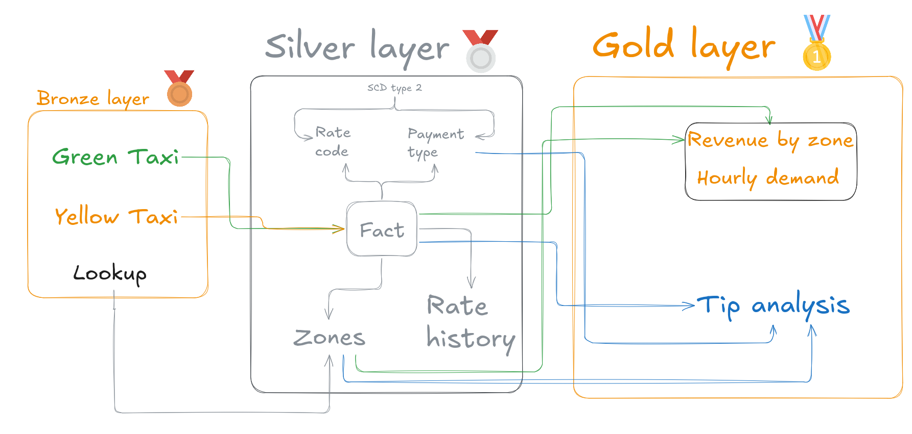
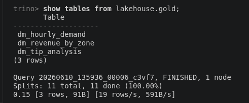
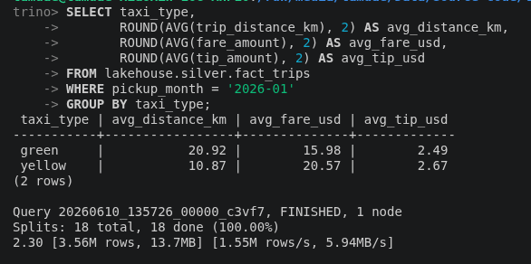

# NYC Taxi Data Lakehouse



## Overview & Advantages
This project implements a modern Data Lakehouse pipeline for NYC Taxi trip data using a Medallion Architecture (Bronze, Silver, and Gold layers). By integrating Apache Iceberg as the table format and MinIO as S3-compatible storage, this system solves critical problems of traditional data lakes, including data consistency issues, storage bloat from repeated job runs, and lack of transaction support. It offers ACID compliance, schema evolution, and time-travel capabilities, ensuring robust batch ingestion and fast analytical queries. With decoupled compute and storage, Spark handles heavy ETL operations while Trino executes high-performance analytical queries.

---

## System Architecture & Metadata Flow

The architecture is fully containerized and orchestrated, consisting of the following core components:

*   **Orchestration**: Apache Airflow schedules and coordinates the entire pipeline.
*   **Storage**: MinIO acts as the S3-compatible Object Storage containing Parquet data and Iceberg metadata.
*   **Metadata Catalog**: An Iceberg REST Catalog powered by PostgreSQL stores the pointers to the latest table snapshots.
*   **ETL Engine**: Apache Spark processes raw data, performs deduplication, normalization, and manages SCD Type 2 history.
*   **OLAP Engine**: Trino executes high-speed, interactive queries directly on the Gold analytical layers.

### Metadata Query Resolution Path


When Trino or Spark executes a query:
1. They call the **Iceberg REST Catalog** to request the metadata pointer for the target table.
2. The REST Catalog queries **PostgreSQL** to fetch the URI of the latest metadata json file.
3. The query engine reads the metadata json and manifests directly from **MinIO**.
4. The query engine retrieves the target Parquet files directly from **MinIO** to complete execution.

---

## Medallion Architecture



The pipeline is organized into three distinct layers to transition raw data into business-ready metrics:

### 1. Bronze Layer (Raw Ingestion)
- **Tables**: `bronze.green_trips`, `bronze.yellow_trips`
- **Logic**: Appends raw monthly taxi data with system auditing columns (`_source_file`, `_ingested_at`, `pickup_month`). Uses dynamic partition overwrites to prevent duplicate data logically.

### 2. Silver Layer (Cleaned & Normalized)
- **Fact Table**: [silver.fact_trips](file:///run/media/tamdae/Data/Source%20code/taxi_lakehouse/spark_jobs/silver/transform_trips.py) (unified and deduplicated taxi trips schema, partitioned by `pickup_month`).
- **Dimension Tables**: 
  - [silver.dim_zones](file:///run/media/tamdae/Data/Source%20code/taxi_lakehouse/spark_jobs/silver/load_zones.py) (location lookups populated from CSV).
  - [silver.dim_payment_types](file:///run/media/tamdae/Data/Source%20code/taxi_lakehouse/spark_jobs/silver/load_payment_types.py) & [silver.dim_rate_codes](file:///run/media/tamdae/Data/Source%20code/taxi_lakehouse/spark_jobs/silver/load_rate_codes.py) (static reference data).
  - [silver.dim_rate_history](file:///run/media/tamdae/Data/Source%20code/taxi_lakehouse/spark_jobs/silver/transform_rate_history.py) (SCD Type 2 tracking monthly average fares and tips by zone).

### 3. Gold Layer (Aggregated Analytics)
- **`gold.dm_revenue_by_zone`**: Monthly revenue metrics and zone rankings.
- **`gold.dm_hourly_demand`**: Hourly passenger demand patterns and busiest zone detection.
- **`gold.dm_tip_analysis`**: Driver tipping frequency and behaviors based on airport trips and payment types.

---

## Airflow Orchestration


The pipeline dependencies are optimized for maximum parallelism:
- **Phase 1**: Initialize metadata tables (`init_tables`).
- **Phase 2**: Parallel raw ingestion (`ingest_green`, `ingest_yellow`) and static lookups ingestion (`load_zones`, `load_payment_types`, `load_rate_codes`).
- **Phase 3**: Union and deduplicate fact records (`transform_trips`).
- **Phase 4**: Incremental SCD Type 2 dimension computation (`transform_rate_history`).
- **Phase 5**: Parallel gold-level aggregation generation (`agg_hourly_demand`, `agg_revenue_by_zone`, `agg_tip_analysis`).
- **Phase 6**: Storage optimization and orphan cleanup (`cleanup_snapshots`).

Detailed task dependencies configuration can be found in [dags/etl.py](file:///run/media/tamdae/Data/Source%20code/taxi_lakehouse/dags/etl.py).

---

## Getting Started

### 1. Build the Spark Container Image
```bash
docker build -t lakehouse-spark:latest ./infra/spark
```

### 2. Launch the Infrastructure
```bash
docker compose up -d
```

### 3. Run Pipeline Manual Verification
You can trigger individual scripts manually inside a container or run the Airflow DAG via the Web UI at [http://localhost:8080](http://localhost:8080).

---

## Querying Data via Trino

Open the Trino interactive CLI terminal:
```bash
docker exec -it trino trino
```

### Verify Gold Layer Tables


```sql
SHOW TABLES FROM lakehouse.gold;
```

### Example 1: Top 5 Busiest Zones by Revenue Rank
```sql
SELECT analysis_month, taxi_type, zone, borough, total_trips, total_revenue, revenue_rank
FROM lakehouse.gold.dm_revenue_by_zone
WHERE revenue_rank <= 5 AND analysis_month = '2026-02'
ORDER BY taxi_type, revenue_rank;
```

### Example 2: Passenger Tipping Analysis


```sql
SELECT borough, payment_type_desc, total_trips, tip_rate_pct, avg_tip_amount, max_tip
FROM lakehouse.gold.dm_tip_analysis
WHERE analysis_month = '2026-02' AND payment_type_desc = 'Credit card'
ORDER BY tip_rate_pct DESC;
```

---

## Automated Maintenance & Storage Cleanup

Over time, repeated partition overwrites can leave orphan files and stale metadata on MinIO. The pipeline includes an automated maintenance task [cleanup_snapshots.py](file:///run/media/tamdae/Data/Source%20code/taxi_lakehouse/spark_jobs/scripts/cleanup_snapshots.py) that runs:

1. **Snapshot Expiration**: Evicts history older than the execution time, keeping only the latest snapshot (`retain_last => 1`) to purge unused parquet files.
2. **Orphan File Cleanup**: Performs bulk deletion on MinIO to remove temporary data files not referenced in any metadata.

This ensures the Lakehouse remains fast, clean, and cost-effective.

---
# Demo
- **Video Walkthrough:** [YouTube Link](https://youtu.be/5SifSdESZeM)